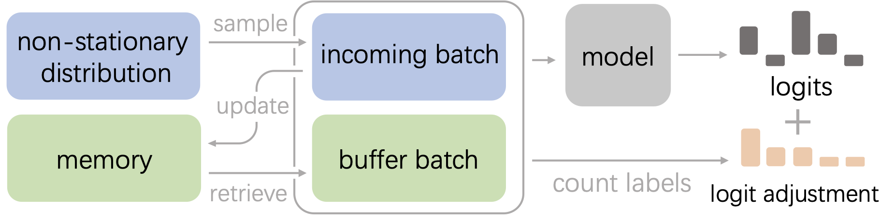

# Online Continual Learning via Logit Adjusted Softmax 

## Method



## Requirements 
* python>=3.8
* pytorch>=1.8.1
* torchvision>=0.9.1
* numpy 
* pillow

## Structure 
```
├── backbone                             # folder for model backbones
├── data
    ├── CIFAR10                          # folder of CIFAR10 dataset
    ├── CIFAR100                         # folder of CIFAR100 dataset
    ├── TINYIMG                          # folder of TinyImageNet dataset
├── datasets
    ├── blurry_cifar100.py               # define blurry CIFAR100        
    ├── blurry_tinyimagenet.py           # define blurry TinyImageNet        
    ├── seq_cifar10.py                   # define disjoint CIFAR10
    ├── seq_cifar100.py                  # define disjoint CIFAR100        
    ├── seq_imagenet.py                  # define disjoint ImageNet        
    ├── seq_inaturalist.py               # define disjoint iNaturalist        
    ├── seq_tinyimagenet.py              # define disjoint TinyImageNet      
├── models       
    ├── aser_las.py                      # ASER_mu with Logit Adjusted Softmax
    ├── er_las.py                        # Experience Replay with Logit Adjusted Softmax
    ├── mir_las.py                       # MIR with Logit Adjusted Softmax
├── utils                                # files for training
├── main.sh                              # script to run experiments
```

## Running Experiments 
```
sh main.sh $model $dataset $buffer_size $tau $window_length
```
For example,
* To run ER-LAS with $\tau=1.0$ and $l=1$ on CIFAR10, buffer size is $0.5k$:
```
sh main.sh er_las seq-cifar10 500 1.0 1
```
* To run ER-LAS with $\tau=1.0$ and $l=10$ on ImageNet, buffer size is $20k$:
```
sh main.sh er_las seq-imagenet 20000 1.0 10
```
* To run MIR-LAS with $\tau=1.0$ and $l=1$ on CIFAR100, buffer size is $2k$:
```
sh main.sh mir_las seq-cifar100 2000 1.0 1
```
* To run ASER $_\mu$-LAS with $\tau=1.0$ and $l=1$ on TinyImageNet, buffer size is $2k$:
```
sh main.sh aser_las seq-tinyimg 2000 1.0 1
```